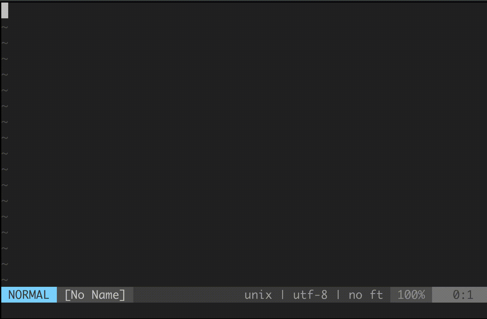

# vim-rfc

Lightweight RFC viewer and syntax highlighting for vim.

* `:RFC 527`

## Installation

* `Plug 'dhulihan/vim-rfc'`

## Why?

* `mhinz/vim-rfc` is excellent but requires ruby
* `jceb/vim-rfc` is great since it opens files from URL, but lacks syntax highlighting.

## Credits

Inspired by the following projects:

* https://github.com/mhinz/vim-rfc
* https://github.com/jceb/vim-rfc
